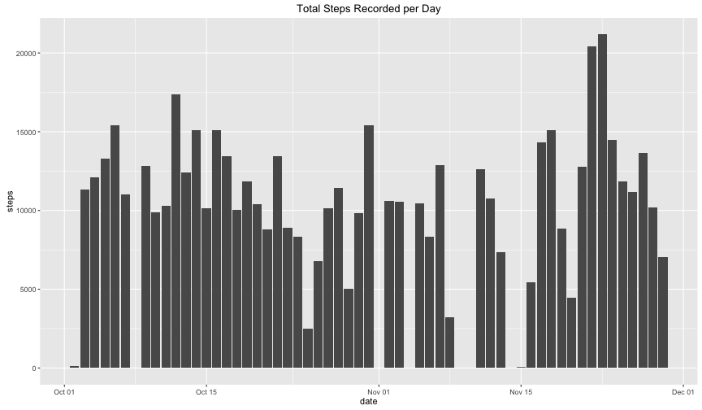

## Initialize anything necessary to this process
     

```r
library(ggplot2)
```

## Loading and preprocessing the data
This analysis is based on a brief set of data simply recording the number of steps taken in any given 5 minute interval over the course of a couple months from a single individual.  The data itself is stored within this repository, and will be extracted from an archival file upon processing and then read into memory.


```r
unzip("activity.zip")
activity <- read.csv("activity.csv")
```

Further, the facilitate analysis, the date field will be converted into an R-recognized date format.    


```r
activity$date <- as.Date(activity$date)
```
     
## What is mean total number of steps taken per day?
First, we want to get a grasp of what has occurred during the time period recorded.  To do this, we'll first get a sum of each day's activity...


```r
total_by_the_day <- aggregate(steps~date, data=activity, FUN="sum", na.rm=T)
all_steps_chart <- ggplot(total_by_the_day, aes(date,steps))
all_steps_chart + geom_bar(stat="identity") + ggtitle("Total Steps Recorded per Day")
```


     
... and establish mean and median steps they individual as taken, overall.


```r
mean_steps <- mean(total_by_the_day$steps, na.rm=T)
median_steps <- median(total_by_the_day$steps, na.rm=T)
```
     
As a result, we see that, in any given day, our indivdual has walked a meean of 1.0766189 &times; 10<sup>4</sup>, and a median of 10765 steps.
     
## What is the average daily activity pattern?
Secondly, we want to get an indication of what this individual did over the course of an average day.


```r
average_steps_by_interval <- aggregate(steps~interval, data=activity, FUN="mean", na.rm=T)
maximum_average_steps_taken <- average_steps_by_interval[average_steps_by_interval$steps==max(average_steps_by_interval$steps),]
maximum_average_steps_taken$interval <- as.factor(sprintf("%04d",maximum_average_steps_taken$interval))
daily_averages_chart <- ggplot(average_steps_by_interval, aes(interval,steps))
daily_averages_chart + geom_path() + ggtitle("Mean Steps Taken per 5 Minute Interval") + xlab("Minutes of Day")
```


     
Upon quick examination, it looks as though, on average, that our participant takes the most steps in the morning, with a maximum average approximately 206 steps taken at 0835 hours.  The participant then goes on to maintain a somewhat steady amount of activity until mid-evening.  It also appears our participate sleeps sane hours.

## Imputing missing values
In looking at these results so far, it certainly appears that there are periods of time where no data is available.  So, next, we will see how many of those non-values there are.


```r
nonvalues <- activity[!complete.cases(activity),]
```

After a quick computation, it looks like there are about 2304 rows missing important details.  Let's set up a second dataset, similar to the first, albeit where our nonvalues have been substituted with the mean steps for that same interval.


```r
estimated_activity <- activity
for(n in 1:nrow(estimated_activity)) { 
     if(is.na(estimated_activity[n,]$steps)) { 
          estimated_activity[n,]$steps <- average_steps_by_interval[average_steps_by_interval$interval==estimated_activity[n,]$interval,]$steps
     }
}
```

With plausible mean values now available in our theoretical data set, let's run the plot again.


```r
imputed_by_the_day <- aggregate(steps~date, data=estimated_activity, FUN="sum", na.rm=T)
imputed_steps_chart <- ggplot(imputed_by_the_day, aes(date,steps))
imputed_steps_chart + geom_bar(stat="identity") + ggtitle("Total Steps Recorded per Day")
```


     
As a result of this effort, our chart has not changed much, but we have gained a few days that were previously missing.


```r
imputed_mean_steps <- mean(imputed_by_the_day$steps)
imputed_median_steps <- median(imputed_by_the_day$steps)
```

Taking a look, now, at our theorical new results, our new mean daily steps of 10766 and median daily steps of 10766 being so close to the original untreated data lend some credence to veracity of these estimated inclusions.  The data seems safe to proceeding with.

## Are there differences in activity patterns between weekdays and weekends?
Lastly, lets take a look at how the activity of our participant differts on the weekend versus weekdays.  First step is to dervice the difference beteween the two in our theoretically completed data set.


```r
estimated_activity$daytype <- as.factor(ifelse(weekdays(estimated_activity$date) %in% c("Saturday","Sunday"), "weekend", "weekday"))
imputed_steps_by_interval <- aggregate(steps~interval, data=estimated_activity, FUN="mean", na.rm=T)
imputed_averages_chart <- ggplot(estimated_activity, aes(interval,steps))
imputed_averages_chart + stat_summary(fun.y='mean',geom='line') + facet_wrap(~daytype,nrow=2) + ggtitle("Imputed Mean Steps Taken per 5 Minute Interval")
```


Separating the 5-minute interval means between weekday and weekend shows a pretty distinct difference.  On the weekday, our participant behcame active earlier and more intensely int he morning.  But, in on the weeekend, where the morning is distinctly lazier, the afternoon busier than on a weekday, if on par with a weekend morning's activity.
